<div align="center">


# matinee

**Staged cursor performances for React.**

[](https://www.npmjs.com/package/matinee)
[](https://github.com/benhowdle89/matinee/actions/workflows/ci.yml)

**[matinee.pages.dev](https://matinee.pages.dev)** &middot; the demo performs itself

</div>

That animation above is not a screen recording, a GIF, or a video embed. It is a single SVG file, generated by matinee from about ten lines of code, committed to this repo, and animating inside a GitHub README. It is 7 kB.

> **Reading this as an LLM or a coding agent?** The complete documentation, including every type signature and the things matinee deliberately does not do, is available as plain text in one file: **[matinee.pages.dev/llms-full.txt](https://matinee.pages.dev/llms-full.txt)**. There is an index at [/llms.txt](https://matinee.pages.dev/llms.txt).

## The problem

Your product does something. To show anyone, you need footage of it being used.

Today you have two options, and both age badly:

- **Screen-record it.** Needs a person, a tidy desktop, and a steady hand. Every UI change means recording it again. Every locale, plan tier or empty state means recording it again.
- **Fake it in After Effects.** Needs a designer and a few hours. Same problem, more expensive.

Either way you end up with a binary file that was accurate on the day it was made. Ship a redesign and every demo you own is quietly wrong.

## What matinee does

You write the demo as **code**. A ghost cursor performs it against your real, running app, driving it with real events, moving like a hand rather than a tween. Then it exports itself as a file you can commit.

Three things follow from the demo being code:

|  |  |
|---|---|
| **It never goes stale** | Rerun it after a redesign and you have a current demo. No re-shoot, no designer, no calendar invite. |
| **It is reviewable** | It is a diff in your repo, sitting next to the feature it demonstrates. It goes through code review like everything else. |
| **It is reproducible** | Same script, same performance, every time. Run it once per locale, per plan, per theme, and get a demo for each. |

## What it unlocks

<table>
<tr>
<td width="50%" valign="top">

**Product demos**

The nine-second clip for your landing page, your changelog entry, your launch tweet. Regenerate it the day the UI changes instead of putting it on someone's to-do list.

</td>
<td width="50%" valign="top">

**Documentation and tutorials**

Show the click path instead of describing it. "Open settings, then billing, then click Upgrade" becomes a small animation that plays inline, in a README, with no video player and no hosting.

</td>
</tr>
<tr>
<td valign="top">

**Marketing and social**

Record the tab to WebM and post it. Same script, different personality, nameplate and accent colour, so one performance yields a family of assets.

</td>
<td valign="top">

**Onboarding walkthroughs**

The cursor drives the real UI, so a guided tour can genuinely do the thing rather than pointing at a hole in a dimmed overlay.

</td>
</tr>
<tr>
<td valign="top">

**Agent and AI product demos**

Every AI product demo shows a cursor using software on the user's behalf. matinee is built for exactly that shot, nameplate and all.

</td>
<td valign="top">

**Design review and bug reports**

A script is a precise, replayable description of an interaction. Attach it to the issue and anyone can watch the same twelve steps happen.

</td>
</tr>
</table>

---

# 1. Install

```sh
npm install matinee
```

React 18 or newer. Zero runtime dependencies.

# 2. Use it

Wrap your app. This is the entire integration:

```tsx
import { Stage } from 'matinee'
import 'matinee/styles.css'

<Stage>
  <YourApp />
</Stage>
```

`<Stage>` renders your app untouched and mounts one fixed, `pointer-events: none`, `aria-hidden` overlay beside it. It cannot affect your layout, cannot intercept a click, and renders nothing on the server.

Then direct the performance from anywhere inside it:

```tsx
import { useEffect } from 'react'
import { useCursor } from 'matinee'

function Demo() {
  const cursor = useCursor()

  useEffect(() => {
    void (async () => {
      await cursor.scrollTo('#pricing')
      await cursor.hover('#pro-plan')
      await cursor.click('#upgrade')
      await cursor.type('#card', '4242 4242 4242 4242')
      await cursor.say('and that is checkout')
    })()
  }, [cursor])

  return <YourApp />
}
```

That is a working demo. Three things worth knowing:

- **Everything queues.** Each method returns a promise that resolves when the motion finishes, and waits its turn if something else is running. `await` is optional; the order is always the order you wrote.
- **Targets resolve at execution time, not call time.** A target is a CSS selector, an `Element`, a ref, or `{ x, y }`. By the time a queued click runs, the page has usually moved on, and matinee looks it up then.
- **The events are real.** Clicks dispatch actual `pointerdown` / `pointerup` / `click` on the actual element, so your app responds exactly as it would to a hand. Typing goes through the prototype value setter, which is what makes React-controlled inputs update instead of silently ignoring it.

# 3. What you get out

One performance. Four different artefacts, depending on what you pass.

### An animated SVG, self-contained


Pass a background and some scenery and the file stands alone. This is what the hero at the top of this page is.

```ts
const svg = cursor.toSvg({
  background: '#faf8f4',
  backdrop: '<rect x="24" y="24" width="512" height="212" rx="10" fill="#fff"/>',
})
```

`backdrop` is raw SVG markup drawn behind the cursor. Anything you can draw, you can stage.

### An animated SVG, transparent (the default)


```ts
const svg = cursor.toSvg()
```

That is the same performance with no scenery: the cursor, the nameplate and the click ripples, on nothing. It looks sparse on its own **because it is meant to go on top of something**, a screenshot or a slide or a video still you already have. Transparent is the default for exactly this reason.

### The same performance, restyled


```ts
const svg = cursor.toSvg({
  color: '#c2410c',
  label: 'Claude',
  background: '#fffaf5',
  backdrop,
})
```

One script, a family of assets. Change the personality too and the motion changes with it.

### A path still, as PNG


```ts
const blob = await cursor.toPathPng()
```

The journey with a marker at every click, on transparency, fading in so the direction reads. Good for a slide or a diagram.

### A video, as WebM

```tsx
const recorder = useRecorder()

<button onClick={recorder.start}>Record</button>
<button onClick={recorder.stop}>Stop</button>
<button onClick={() => recorder.download('demo.webm')}>Download</button>
```

Honestly: this wraps `getDisplayMedia` and `MediaRecorder`, so it records the real tab and it costs one browser permission prompt. There is no way around the prompt, and there should not be. A page should not be able to capture itself unasked. matinee does not attempt to render the DOM to a canvas; that road produces something subtly wrong for every non-trivial page.

## Configuring the SVG export

| Option | Type | Default | What it does |
|---|---|---|---|
| `background` | `'transparent' \| string` | `'transparent'` | Fills the canvas. Leave it transparent to overlay a screenshot; set a colour for a standalone clip. |
| `backdrop` | `string` | none | Raw SVG markup drawn behind the cursor. Your scenery. |
| `label` | `string \| false` | `'Agent'` | The nameplate. `false` removes it and its styles. |
| `color` | `string` | `#2f6bff` | Nameplate and ripple accent. |
| `width` | `number` | recorded width | Rendered width. The `viewBox` keeps the aspect ratio. |
| `loop` | `boolean` | `true` | `false` plays once and holds the last frame. |
| `traits` | `Traits` | Stage personality | Overrides the motion character for this export only. |
| `fps` | `number` | `24` | Sample rate. Higher is smoother and larger. |

Called from a `<Stage>`, `toSvg()` inherits that stage's colour and personality, so most of the time you pass nothing.

## What is actually in the file

A complete, real export of a two-step performance, in full:

```svg
<svg xmlns="http://www.w3.org/2000/svg" width="400" height="200" viewBox="0 0 400 200">
<style>
  /* the still frame, for anyone with reduced motion turned on */
  .mt-cursor { transform: translate(300px, 70px) }

  @media (prefers-reduced-motion: no-preference) {
    .mt-cursor { animation: mt-travel 1500ms linear infinite both }
    .mt-rip    { animation: mt-ripple 1500ms linear infinite both }
  }

  /* the motion: one keyframe per sampled position of the real curve */
  @keyframes mt-travel {
    0%       { transform: translate(40px, 160px) }
    8.3333%  { transform: translate(100.59px, 129.93px) }
    16.6667% { transform: translate(256.62px, 77.12px) }
    25%      { transform: translate(309.83px, 68.71px) }   /* the overshoot */
    33.3333% { transform: translate(300px, 70px) }         /* settled */
    100%     { transform: translate(300px, 70px) }
  }
</style>

<!-- one circle per click, fired at the recorded moment via animation-delay -->
<circle class="mt-rip" cx="300" cy="70" r="20" style="animation-delay:870ms"/>

<!-- the only thing that moves: the arrow and its nameplate -->
<g class="mt-cursor">
  <path d="M5 2.5 L5 19.4 …" fill="#fff" stroke="rgba(17,17,20,0.92)"/>
  <g transform="translate(15,17)">
    <rect class="mt-chip-bg" width="51" height="21" rx="6"/>
    <text class="mt-chip-tx" x="9" y="14.5">Agent</text>
  </g>
</g>
</svg>
```

- The keyframes are not a path plus an easing function. They are **literally where the cursor was**, sampled from the same motion code that ran on screen, which is how the overshoot at `25%` survives into the file.
- The `viewBox` is your page's coordinate space, so the cursor lands where it landed.
- There is no `<script>` and no external reference of any kind. That is precisely the shape GitHub's image sandbox renders: it serves the file under `default-src 'none'; style-src 'unsafe-inline'; sandbox`, which allows an inline `<style>` block and nothing else.
- **It never contains your app.** matinee does not rasterise the DOM, so the export has no idea what your page looks like. That is a deliberate limit: every DOM-to-image approach produces something subtly wrong for any non-trivial page.

One consequence worth knowing: because the export has no concept of scroll offset, a performance containing `scrollTo` cannot line up with a single static image. Keep exportable takes scroll-free.

### Putting one in a README

```md

```

That is the whole trick, and it is why the animation at the top of this page moves.

---

## Personalities

One prop changes the character of the whole performance. Same script in all three:

<table>
<tr>
<th align="center">confident</th>
<th align="center">curious</th>
<th align="center">caffeinated</th>
</tr>
<tr>
<td></td>
<td></td>
<td></td>
</tr>
<tr>
<td align="center">brisk, low curvature,<br>slight overshoot</td>
<td align="center">slower, wanders,<br>barely overshoots</td>
<td align="center">fast, overshoots hard,<br>jittery at rest</td>
</tr>
</table>

```tsx
<Stage personality="caffeinated" />
```

## Why the motion looks right

This is the part everything else rests on. A cursor that lerps between two points reads as a computer instantly. Four things fix that:

- **Curved paths.** Every journey is a cubic bezier whose control points are pushed perpendicular to the straight line, randomised within the personality's bounds. Two trips between the same two buttons never trace the same arc.
- **Minimum-jerk velocity.** The easing is `10t³ − 15t⁴ + 6t⁵`, the standard model from motor control research for how a human arm moves between two points. It was not picked by eye.
- **Overshoot and settle.** Human reaching is two movements, not one: a fast ballistic throw that lands slightly wrong, then a small corrective one. matinee models both. A single smooth arrival is the tell that gives away every tweened cursor.
- **A tremor underneath.** Sub-pixel, never repeating, fading out as the cursor settles.

## API

### The actor

```ts
const cursor = useCursor()

type Target = string | Element | { current: Element | null } | { x: number; y: number }

cursor.moveTo(target: Target): Promise<void>
cursor.click(target?: Target): Promise<void>
cursor.dblclick(target?: Target): Promise<void>
cursor.type(target: Target, text: string): Promise<void>
cursor.scrollTo(target: Target): Promise<void>
cursor.hover(target: Target, ms?: number): Promise<void>
cursor.pause(ms?: number): Promise<void>
cursor.say(text: string, ms?: number): Promise<void>
cursor.show(): Promise<void>
cursor.hide(): Promise<void>
cursor.getScript(): Script
cursor.clearScript(): void
cursor.play(script: Script): Promise<void>
cursor.toSvg(options?: SvgOptions): string
cursor.toPathPng(options?: PngOptions): Promise<Blob>
cursor.position: { x: number; y: number }
```

| Method | What it does |
|---|---|
| `moveTo(target)` | Travels there |
| `click(target?)` | Moves there if given a target, then dispatches real pointer and click events |
| `dblclick(target?)` | As above, twice, then `dblclick` |
| `type(target, text)` | Focuses, then types with human cadence |
| `scrollTo(target)` | Smooth-scrolls the page or nearest scrollable container to bring it into view |
| `hover(target, ms?)` | Moves there and rests |
| `pause(ms?)` | Idle drift and a thinking pulse |
| `say(text, ms?)` | Speech bubble beside the cursor |
| `show()` / `hide()` | Fades in and out |
| `getScript()` / `play(script)` | The performance as data, and back again |
| `toSvg()` / `toPathPng()` | Exports |

### The stage

| Prop | Type | Default | |
|---|---|---|---|
| `label` | `string \| false` | `"Agent"` | Nameplate riding with the cursor |
| `color` | `string` | `#2f6bff` | Nameplate, ripple and trail accent |
| `cursor` | `"pointer" \| "hand" \| ReactNode` | `"pointer"` | |
| `personality` | `"confident" \| "curious" \| "caffeinated"` | `"confident"` | Speed, curvature, overshoot, idle drift |
| `trail` | `boolean \| number` | `false` | Fading motion trail; a number sets the length |
| `scale` | `number` | `1` | |
| `zIndex` | `number` | `9999` | |
| `respectReducedMotion` | `boolean` | `true` | Jump-cuts instead of animating under `prefers-reduced-motion` |
| `onScriptChange` | `(script: Script) => void` |  | Fires as the performance is recorded |

## Scripts

Every performance records itself as plain data while it runs:

```ts
const script = cursor.getScript()
// { version: 1, viewport: {...}, seed, origin, steps: [...] }

await cursor.play(script)
```

It is JSON all the way down (no functions, no element references), so you can store it, post it, diff it in review, or replay it in a different session. Selector targets are stored as selectors so they survive rerenders; point targets are rescaled if the script is replayed on a different viewport.

## Accessibility

The overlay is `aria-hidden` and `pointer-events: none`, always. `respectReducedMotion` is honoured everywhere, including inside the exported SVG. Multiple `<Stage>`s on one page do not fight: each owns its own actor and its own overlay, and nothing is leaked to a global.

## Not supported

Stated explicitly, because these are the things people (and code generators) assume exist:

- **No multiple simultaneous cursors.** One actor per `<Stage>`.
- **No GIF export.** SVG, WebM and PNG only.
- **No headless or CLI rendering.** matinee runs in a browser.
- **No drag action.** There is no `cursor.drag()`.
- **No framework adapters.** React only. No Vue, Svelte or vanilla build.
- **No plugin system**, no middleware, no custom action registration.
- **No recorder that captures a real user's mouse** into a script. Scripts are written, or produced by running a performance.
- **No DOM-to-image rendering of your app**, in any export.

## Not to be confused with

- **[ghost-cursor](https://github.com/Xetera/ghost-cursor)**: human-like mouse movement for Puppeteer, built for bot evasion. matinee stages performances; it is not a disguise.
- **[Screen Studio](https://screen.studio)**: records your real screen beautifully. matinee performs your app instead of filming it, which means it re-renders when the UI changes.
- **[rrweb](https://github.com/rrweb-io/rrweb)**: records and replays real user sessions. matinee's scripts are written, not captured.

## License

MIT © [Ben Howdle](https://benji.org)
