<div align="center">


# matinee

**Staged cursor performances for React.**

[](https://www.npmjs.com/package/matinee)
[](https://github.com/benhowdle89/matinee/actions/workflows/ci.yml)

**[matinee.pages.dev](https://matinee.pages.dev)** &middot; the demo performs itself

</div>

That animation above is not a screen recording, a GIF, or a video embed. It is a single SVG file, generated by matinee from about ten lines of code, committed to this repo, and animating inside a GitHub README. It is 7 kB.

## The problem

Your product does something. To show anyone, you need footage of it being used.

Today you have two options, and both age badly:

- **Screen-record it.** Needs a person, a tidy desktop, and a steady hand. Every UI change means recording it again. Every locale, plan tier or empty state means recording it again.
- **Fake it in After Effects.** Needs a designer and a few hours. Same problem, more expensive.

Either way you end up with a binary file that was accurate on the day it was made. Ship a redesign and every demo you own is quietly wrong.

## What matinee does

You write the demo as **code**. A ghost cursor performs it against your real, running app, driving it with real events, moving like a hand rather than a tween.

```tsx
await cursor.moveTo('#search')
await cursor.type('#search', 'invoices from March')
await cursor.click('#submit')
await cursor.say('and there it is')
```

Then the performance exports itself: as an animated SVG for a README, as a WebM for a launch video, or as a still.

Three things follow from the demo being code:

|  |  |
|---|---|
| **It never goes stale** | Rerun it after a redesign and you have a current demo. No re-shoot, no designer, no calendar invite. |
| **It is reviewable** | It is a diff in your repo, sitting next to the feature it demonstrates. It goes through code review like everything else. |
| **It is reproducible** | Same script, same performance, every time. Run it once per locale, per plan, per theme, and get a demo for each. |

## What it unlocks

<table>
<tr>
<td width="50%" valign="top">

**Product demos**

The nine-second clip for your landing page, your changelog entry, your launch tweet. Regenerate it the day the UI changes instead of putting it on someone's to-do list.

</td>
<td width="50%" valign="top">

**Documentation and tutorials**

Show the click path instead of describing it. "Open settings, then billing, then click Upgrade" becomes a small animation that plays inline, in a README, with no video player and no hosting.

</td>
</tr>
<tr>
<td valign="top">

**Marketing and social**

Record the tab to WebM and post it. Same script, different personality, different nameplate, different accent colour, so one performance yields a family of assets.

</td>
<td valign="top">

**Onboarding walkthroughs**

The cursor drives the real UI, so a guided tour can genuinely do the thing rather than pointing at a hole in a dimmed overlay.

</td>
</tr>
<tr>
<td valign="top">

**Agent and AI product demos**

Every AI product demo shows a cursor using software on the user's behalf. matinee is built for exactly that shot, nameplate and all, without pretending an agent is driving when one is not.

</td>
<td valign="top">

**Design review and bug reports**

A script is a precise, replayable description of an interaction. Attach it to the issue and anyone can watch the same twelve steps happen.

</td>
</tr>
</table>

## Curtain up

```sh
npm install matinee
```

Two lines to integrate:

```tsx
import { Stage } from 'matinee'
import 'matinee/styles.css'

<Stage>
  <YourApp />
</Stage>
```

`<Stage>` renders your app untouched and mounts one fixed, `pointer-events: none`, `aria-hidden` overlay beside it. It cannot affect your layout, cannot intercept a click, and renders nothing on the server.

## Your first performance

A complete, working example. This is the whole file.

```tsx
import { useEffect } from 'react'
import { Stage, useCursor } from 'matinee'
import 'matinee/styles.css'

function Demo() {
  const cursor = useCursor()

  useEffect(() => {
    void (async () => {
      await cursor.scrollTo('#pricing')
      await cursor.hover('#pro-plan')
      await cursor.click('#upgrade')
      await cursor.type('#card', '4242 4242 4242 4242')
      await cursor.say('and that is checkout')
    })()
  }, [cursor])

  return <YourApp />
}

export default () => (
  <Stage label="Agent" personality="confident" trail>
    <Demo />
  </Stage>
)
```

Every method returns a promise that resolves when the motion finishes, and queues if you call it while something else is running. `await` is optional; the order is always the order you wrote.

Targets are a CSS selector, an `Element`, a ref, or `{ x, y }`, and they resolve **at execution time, not call time**. By the time a queued click runs, the page has usually moved on.

Clicks dispatch real `pointerdown` / `pointerup` / `click` events on the real element, so your app responds exactly as it would to a hand. Typing goes through the prototype value setter, which is what makes React-controlled inputs actually update instead of silently ignoring it.

## Why the motion looks right

This is the part everything else rests on. A cursor that lerps between two points reads as a computer instantly. Four things fix that:

- **Curved paths.** Every journey is a cubic bezier whose control points are pushed perpendicular to the straight line, randomised within the personality's bounds. Two trips between the same two buttons never trace the same arc.
- **Minimum-jerk velocity.** The easing is `10t³ − 15t⁴ + 6t⁵`, the standard model from motor control research for how a human arm moves between two points. It was not picked by eye.
- **Overshoot and settle.** Human reaching is two movements, not one: a fast ballistic throw that lands slightly wrong, then a small corrective one. matinee models both. A single smooth arrival is the tell that gives away every tweened cursor.
- **A tremor underneath.** Sub-pixel, never repeating, fading out as the cursor settles.

## Personalities

One prop changes the whole character of the performance. Same script in all three:

<table>
<tr>
<th align="center">confident</th>
<th align="center">curious</th>
<th align="center">caffeinated</th>
</tr>
<tr>
<td></td>
<td></td>
<td></td>
</tr>
<tr>
<td align="center">brisk, low curvature,<br>slight overshoot</td>
<td align="center">slower, wanders,<br>barely overshoots</td>
<td align="center">fast, overshoots hard,<br>jittery at rest</td>
</tr>
</table>

```tsx
<Stage personality="caffeinated" />
```

## The actor

```ts
const cursor = useCursor()
```

| Method | What it does |
|---|---|
| `moveTo(target)` | Travels there |
| `click(target?)` | Moves there if given a target, then dispatches real pointer and click events |
| `dblclick(target?)` | As above, twice, then `dblclick` |
| `type(target, text)` | Focuses, then types with human cadence |
| `scrollTo(target)` | Smooth-scrolls the page or nearest scrollable container to bring it into view |
| `hover(target, ms?)` | Moves there and rests |
| `pause(ms?)` | Idle drift and a thinking pulse |
| `say(text, ms?)` | Speech bubble beside the cursor |
| `show()` / `hide()` | Fades in and out |
| `getScript()` / `play(script)` | The performance as data, and back again |
| `toSvg()` / `toPathPng()` | Exports |

## The stage

| Prop | Type | Default | |
|---|---|---|---|
| `label` | `string \| false` | `"Agent"` | Nameplate riding with the cursor |
| `color` | `string` | `#2f6bff` | Nameplate, ripple and trail accent |
| `cursor` | `"pointer" \| "hand" \| ReactNode` | `"pointer"` | |
| `personality` | `"confident" \| "curious" \| "caffeinated"` | `"confident"` | Speed, curvature, overshoot, idle drift |
| `trail` | `boolean \| number` | `false` | Fading motion trail; a number sets the length |
| `scale` | `number` | `1` | |
| `zIndex` | `number` | `9999` | |
| `respectReducedMotion` | `boolean` | `true` | Jump-cuts instead of animating under `prefers-reduced-motion` |
| `onScriptChange` | `(script: Script) => void` |  | Fires as the performance is recorded |

## Exports

### Animated SVG, the one that matters

```ts
const svg = cursor.toSvg({ width: 720 })
```

**This animates inside a GitHub README.** That is the whole trick, and it is why the hero at the top of this page moves. Drop it in with plain markdown:

```md

```

The file is entirely self-contained. The keyframes, the glyph, the nameplate and the colour are all inline. There is no `<script>` tag and no external reference of any kind, because that is precisely the shape GitHub's image sandbox will render: it serves the file under `default-src 'none'; style-src 'unsafe-inline'; sandbox`, which permits an inline `<style>` block and nothing else.

Transparent by default, so it sits on top of a screenshot you already have. The animation is wrapped in `@media (prefers-reduced-motion: no-preference)`, so a reader who has asked for less motion gets a composed still instead.

**One thing to know:** `toSvg()` exports the cursor, not your page. matinee never rasterises the DOM. On its own you get the motion on transparency, ready to lay over your own screenshot. To produce a self-contained clip like the hero, pass scenery:

```ts
cursor.toSvg({
  background: '#faf8f4',
  backdrop: '<rect x="20" y="20" width="380" height="190" rx="10" fill="#fff"/>',
})
```

Because the export has no concept of scroll offset, a performance containing `scrollTo` cannot line up with any single static image. Keep exportable takes scroll-free.

### Video

```tsx
const recorder = useRecorder()

<button onClick={recorder.start}>Record</button>
<button onClick={recorder.stop}>Stop</button>
<button onClick={() => recorder.download('demo.webm')}>Download</button>
```

Honestly: this wraps `getDisplayMedia` and `MediaRecorder`, so it records the real tab and it costs one browser permission prompt. There is no way around the prompt, and there should not be. A page should not be able to capture itself unasked. matinee does not attempt to render the DOM to a canvas; that road produces something subtly wrong for every non-trivial page.

### Path PNG

```ts
const blob = await cursor.toPathPng()
```

A still of the journey with a marker at every click, on transparency.

## Scripts

Every performance records itself as plain data while it runs:

```ts
const script = cursor.getScript()
// { version: 1, viewport: {...}, seed, origin, steps: [...] }

await cursor.play(script)
```

It is JSON all the way down (no functions, no element references), so you can store it, post it, diff it in review, or replay it in a different session. Selector targets are stored as selectors so they survive rerenders; point targets are rescaled if the script is replayed on a different viewport.

## Accessibility

The overlay is `aria-hidden` and `pointer-events: none`, always. `respectReducedMotion` is honoured everywhere, including inside the exported SVG. Multiple `<Stage>`s on one page do not fight: each owns its own actor and its own overlay, and nothing is leaked to a global.

## Not to be confused with

- **[ghost-cursor](https://github.com/Xetera/ghost-cursor)**: human-like mouse movement for Puppeteer, built for bot evasion. matinee stages performances; it is not a disguise.
- **[Screen Studio](https://screen.studio)**: records your real screen beautifully. matinee performs your app instead of filming it, which means it re-renders when the UI changes.
- **[rrweb](https://github.com/rrweb-io/rrweb)**: records and replays real user sessions. matinee's scripts are written, not captured.

## Requirements

React 18 or newer. Zero runtime dependencies.

## License

MIT © [Ben Howdle](https://benji.org)
